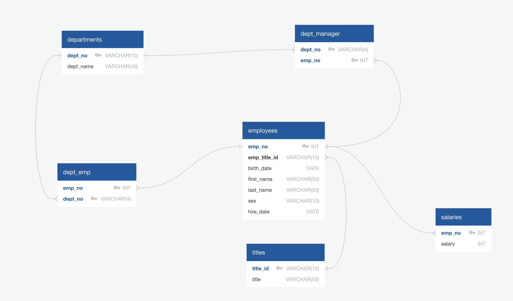
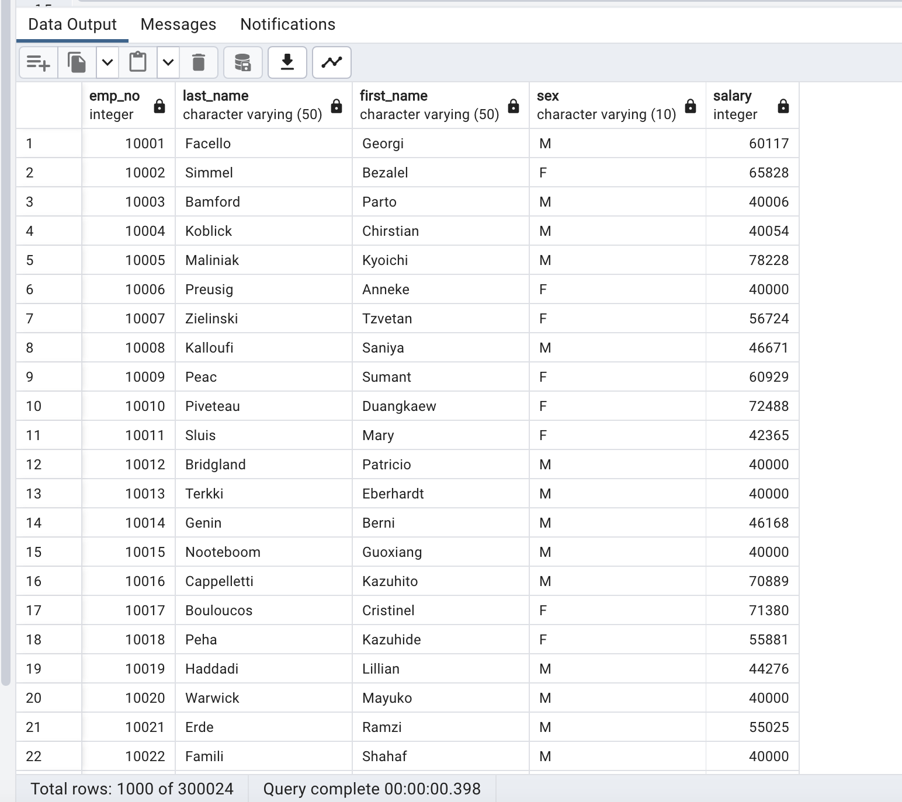
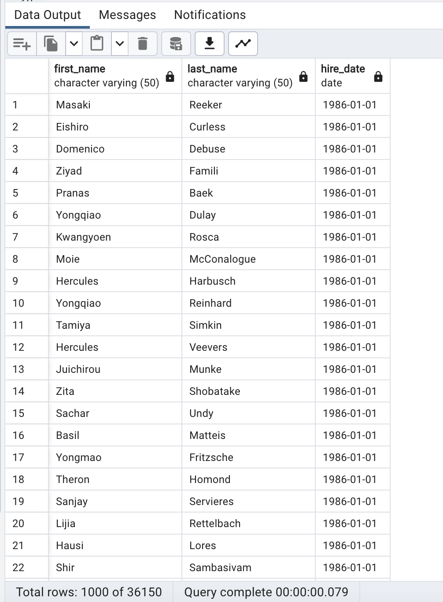
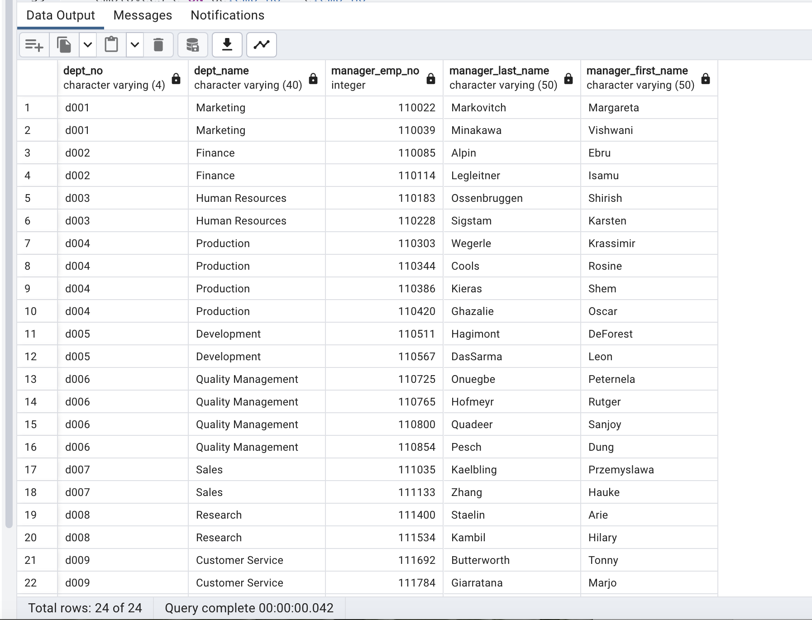
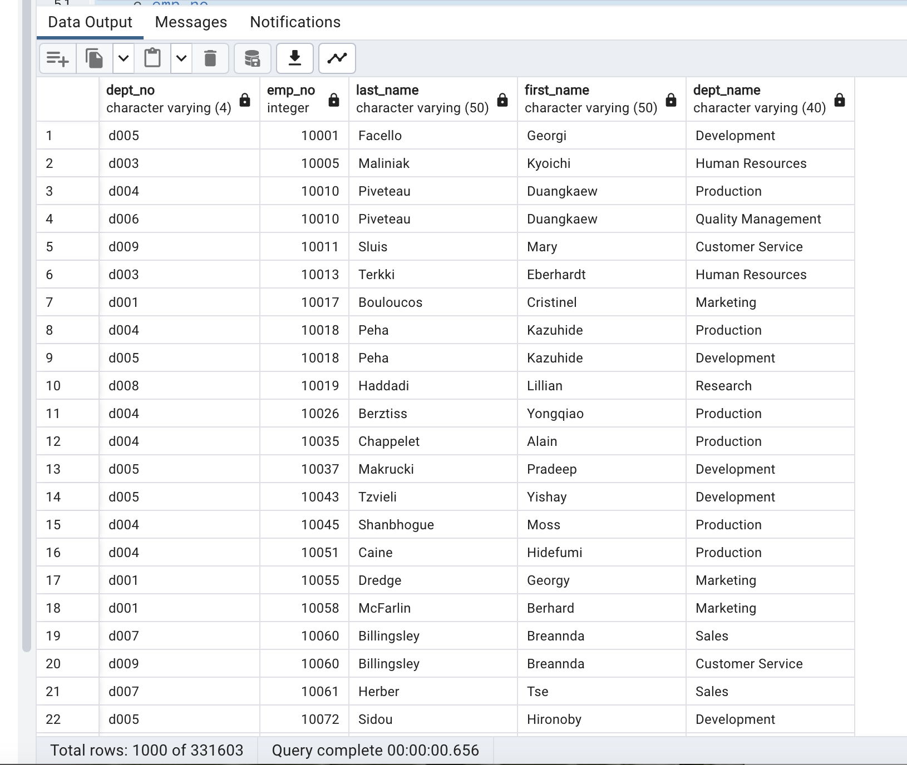
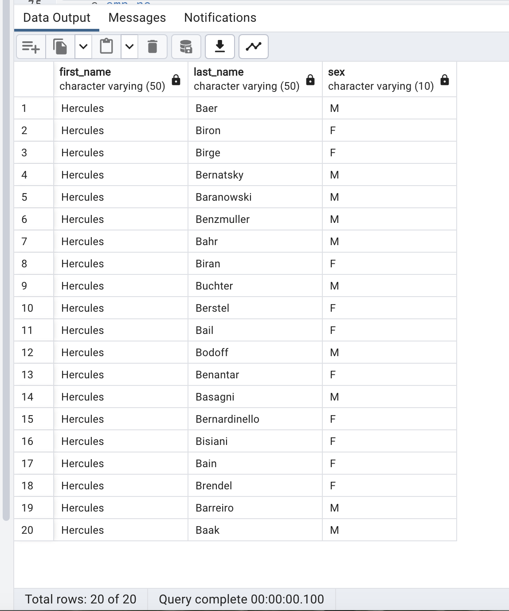
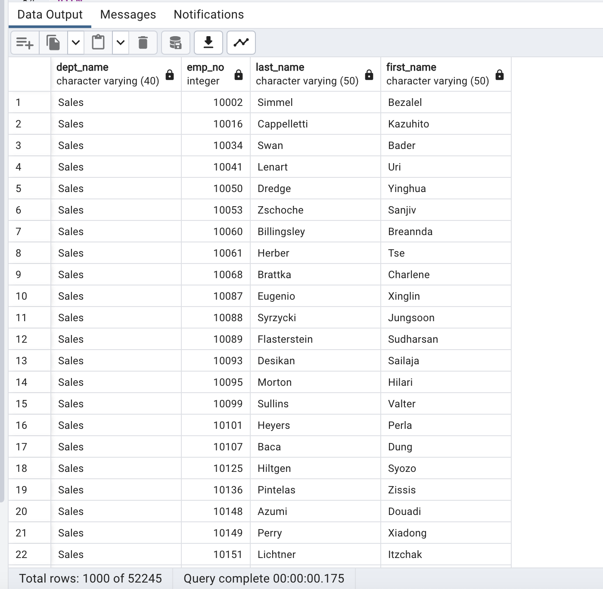
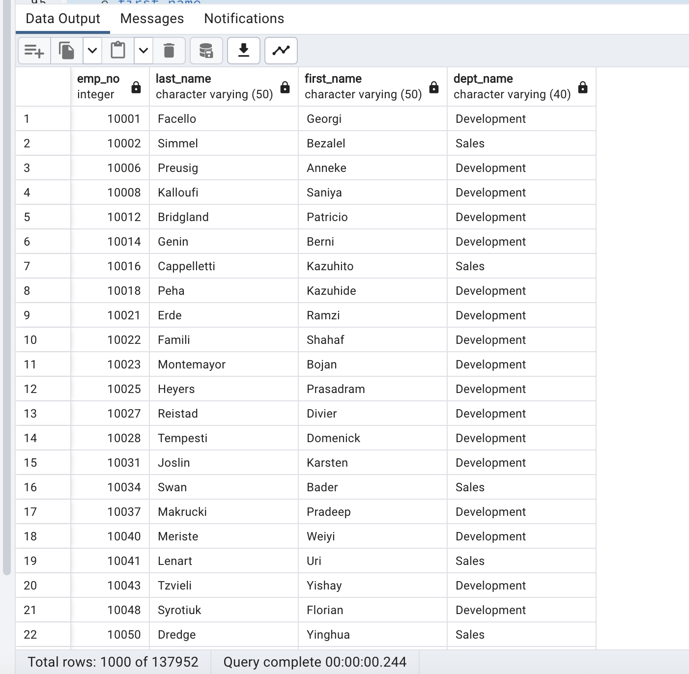
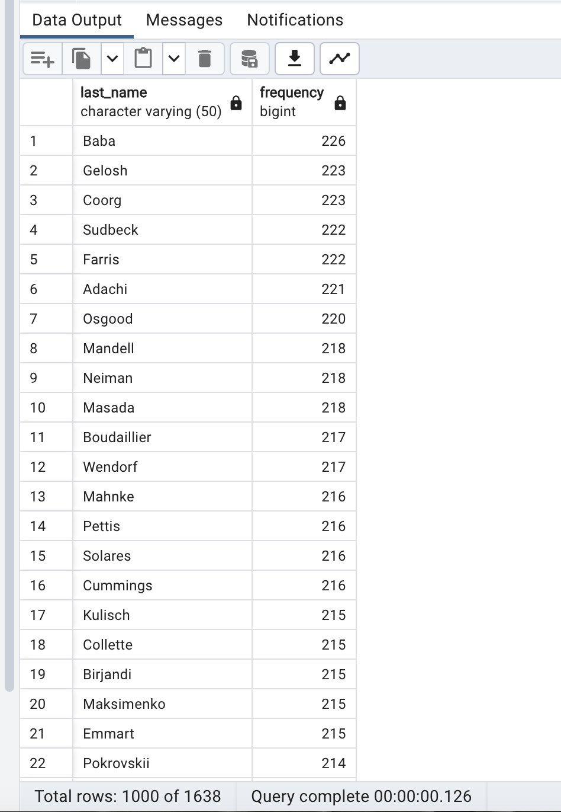

# sql-challenge
A SQL project for analyzing employment data to give insights about employee demographics, salaries, hire dates, departments, and department managers.

## Table of Contents
#### Introduction
#### Requirements & Dependencies
#### Analysis and Results
#### Usage
#### Contributing
#### License
 

#### Introduction
This project analyzes employees data using SQL to answer questions about employee demographics, managers, salaries and certain departments.
 

#### Requirements & Dependencies
- PostgreSQL database server
- pgAdmin or any other compatible SQL query tool
- The appropriate CSV files
 

#### Project Structure
- **Database Setup:** The project starts with creating a database schema in a Jupyter Notebook file, and then executed step-by-step in a pgAdmin 4 query tool. The schema defines tables and relationships to load the provided data, as shown below:

 
 

---
- **Loading Data:** CSV files containing information about employees, departments, salaries, etc., were loaded into the respective database tables.

- **Analysis:** SQL queries were used to analyze the data to answer specified questions.

- **Results:** The analysis results are presented as tables with the specified columns.
 

#### Analysis and Results
##### Eight tasks were performed as follows:

**1.** List the employee number, last name, first name, sex, and salary of each employee.
#### Output

 
 
 
 
 

---
**2.** List the first name, last name, and hire date for the employees who were hired in 1986.
#### Output

 
 
 
 
 

---
**3.** List the manager of each department along with their department number, department name, employee number, last name, and first name.
#### Output

 
 
 
 
 

---
**4.** List the department number for each employee along with that employee’s employee number, last name, first name, and department name.
#### Output

 
 
 
 
 

---
**5.** List first name, last name, and sex of each employee whose first name is Hercules and whose last name begins with the letter B.
#### Output

 
 
 
 
 

---
**6.** List each employee in the Sales department, including their employee number, last name, and first name.
#### Output

 
 
 
 
 

---
**7.** List each employee in the Sales and Development departments, including their employee number, last name, first name, and department name.
#### Output

 
 
 
 
 

---
**8.** List the frequency counts, in descending order, of all the employee last names (that is, how many employees share each last name).
#### Output

 
 
 
 
 

---
#### Usage
1. Set up a PostgreSQL database server and create a database.
2. Use pgAdmin or another compatible SQL tool to execute the schema creation script (schema.sql).
3. Load the provided CSV files into their respective tables.
4. Execute the analysis queries (analysis.sql) to answer the specified or other appropriate questions.
5. Review the analysis results presented in tables.

#### Contributions
Contributions to this projects are highly encouraged! If you wish to contribute, please follow these guidelines:

- Fork the sql-challenge repository and clone it locally.
- Create a new branch for your feature or bug fix.
- Commit your changes with descriptive commit messages.
- Push your branch to your forked repository.
- Submit a pull request to the original repository.
- Please ensure that your code adheres to the project's coding style and conventions.

If you encounter any issues or have suggestions for improvements, please open an issue on the GitHub repository.

### License
These projects are licensed under the MIT License. Feel free to use, modify, and distribute the code as per the terms of the license. 
